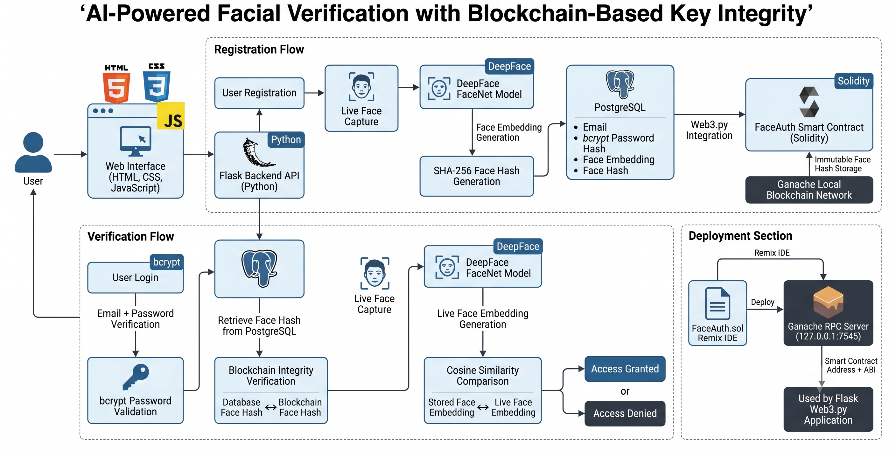
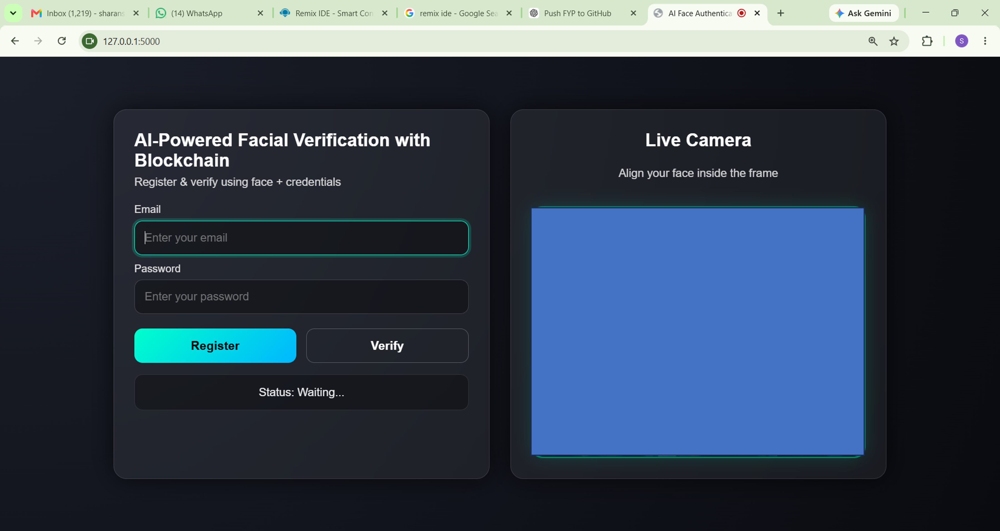
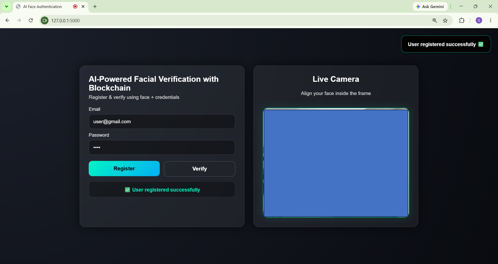
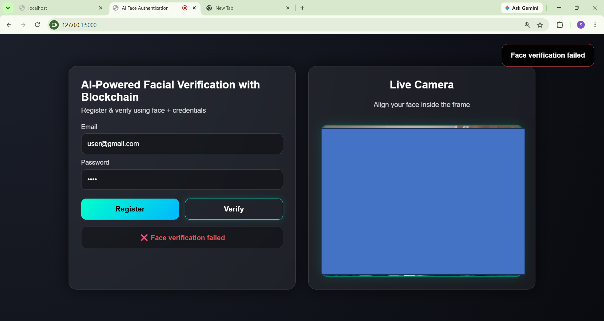
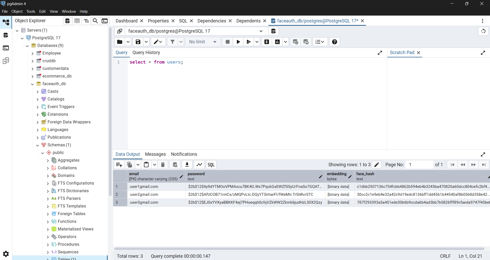
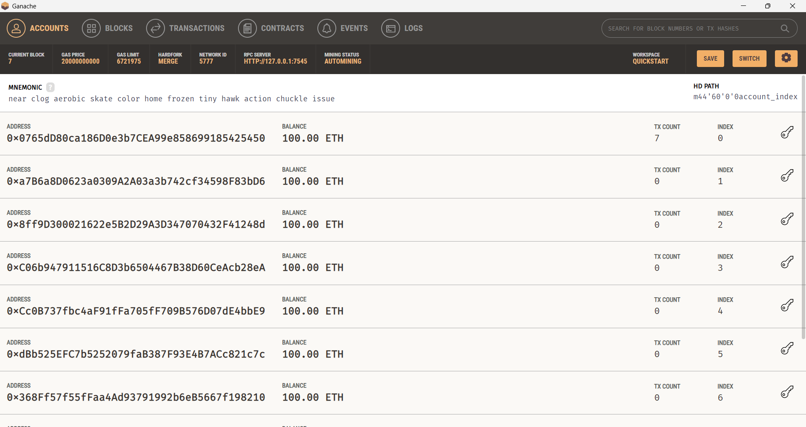
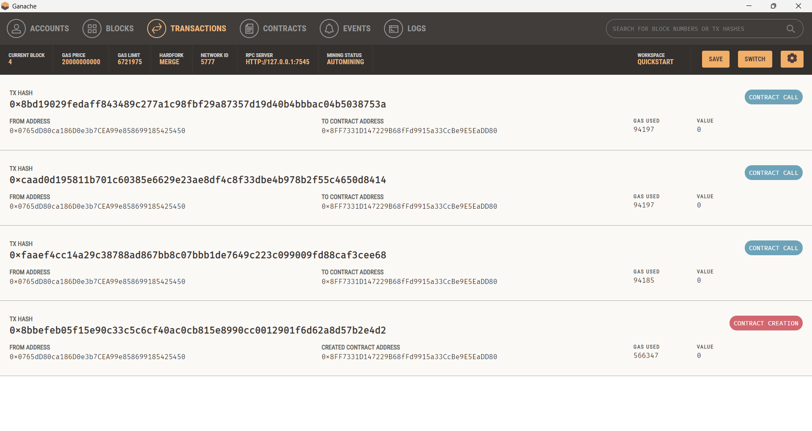
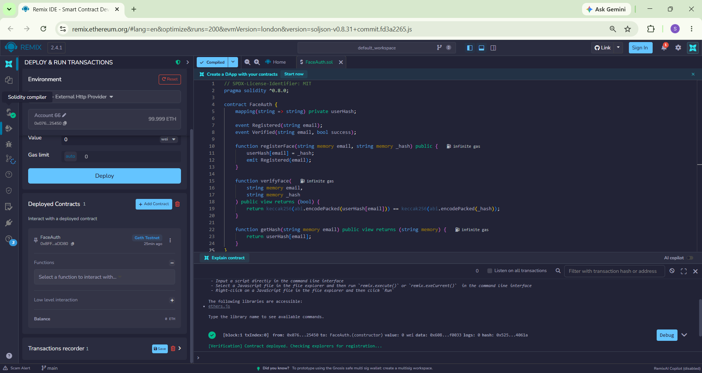

# AI-Powered Facial Verification with Blockchain-Based Key Integrity

A secure identity authentication system that combines **AI-powered facial verification** with **blockchain-based integrity validation** to provide tamper-resistant authentication.

This project leverages **DeepFace FaceNet**, **Flask**, **PostgreSQL**, **Solidity Smart Contracts**, and **Ganache Blockchain** to verify user identities while ensuring the integrity of facial biometric data through decentralized storage of cryptographic hashes.

---

## Project Overview

Traditional authentication systems rely on passwords and centralized databases, making them vulnerable to data breaches, credential theft, and unauthorized modifications.

This project introduces a secure authentication framework where:

* Facial verification is performed using AI-powered FaceNet embeddings.
* Passwords are securely stored using bcrypt hashing.
* Facial embedding hashes are generated using SHA-256.
* Blockchain stores immutable facial hashes for integrity verification.
* PostgreSQL stores user credentials and embeddings.
* Blockchain detects unauthorized modifications to stored biometric data.

---

## Key Features

* AI-powered facial verification using DeepFace FaceNet
* Real-time webcam-based face authentication
* SHA-256 facial embedding hash generation
* Blockchain-based integrity verification
* bcrypt password hashing
* PostgreSQL database integration
* Smart contract implementation using Solidity
* Ganache local blockchain deployment
* Flask REST API backend
* Tamper detection through blockchain validation

---

## Technology Stack

### Frontend

* HTML5
* CSS3
* JavaScript

### Backend

* Python
* Flask
* Flask-CORS

### AI & Machine Learning

* DeepFace
* FaceNet
* OpenCV
* NumPy

### Database

* PostgreSQL

### Security

* bcrypt
* SHA-256

### Blockchain

* Solidity
* Remix IDE
* Ganache
* Web3.py

---

## System Architecture



---

## Project Workflow

### Registration

1. User enters email and password.
2. Live facial image is captured through webcam.
3. DeepFace FaceNet generates a facial embedding.
4. SHA-256 hash is generated from the embedding.
5. Password is hashed using bcrypt.
6. User information is stored in PostgreSQL.
7. Facial hash is stored on blockchain using a Solidity smart contract.

### Verification

1. User enters email and password.
2. Password is validated using bcrypt.
3. Facial hash stored in PostgreSQL is compared with the blockchain hash.
4. If integrity validation succeeds:

   * Live facial image is captured.
   * FaceNet generates a new embedding.
   * Cosine similarity is calculated.
5. User is authenticated if similarity is within threshold.

---

## Blockchain Integrity Verification

The blockchain stores only the SHA-256 hash of the facial embedding.

During login:

* PostgreSQL face hash is retrieved.
* Blockchain face hash is retrieved.
* Both hashes are compared.
* Any unauthorized modification is detected immediately.

This prevents tampering of biometric data stored in the database.

---

## Smart Contract

The project uses a Solidity smart contract named **FaceAuth**.

Functions:

### Register Face Hash

```solidity
registerFace(email, faceHash)
```

Stores facial hash on blockchain.

### Verify Face Hash

```solidity
verifyFace(email, faceHash)
```

Checks database hash against blockchain hash.

### Get Stored Hash

```solidity
getHash(email)
```

Retrieves stored blockchain hash.

---

## Screenshots

### Main Interface



### Registration Success



### Face Verification Success


### Face Verification Failure



### PostgreSQL Database



### Ganache Blockchain



### Blockchain Transaction



### Smart Contract Deployment



---

## Database Schema

### Users Table

| Column    | Description                   |
| --------- | ----------------------------- |
| email     | User email                    |
| password  | bcrypt hashed password        |
| embedding | Serialized FaceNet embedding  |
| face_hash | SHA-256 facial embedding hash |

---

## Installation

### Clone Repository

```bash
git clone https://github.com/sharankumar-k/ai-blockchain-face-authentication.git
cd ai-blockchain-face-authentication
```

### Install Dependencies

```bash
pip install -r backend/requirements.txt
```

### Start PostgreSQL

Create a database and update credentials inside:

```python
backend/database.py
```

Start Ganache Desktop Application

Ensure Ganache is running and exposes a local RPC endpoint:

http://127.0.0.1:7545

This RPC endpoint is used by Remix IDE and Web3.py to interact with the local blockchain network.

### Deploy Smart Contract

1. Open Remix IDE.
2. Compile FaceAuth.sol.
3. Connect Remix to Ganache.
4. Deploy contract.
5. Copy ABI and Contract Address.
6. Update backend/blockchain.py.

### Run Application

```bash
cd backend
py app.py
```

Open:

```text
http://127.0.0.1:5000
```
```
## Author

**Sharan Kumar K**

Final Year Project

AI-Powered Facial Verification with Blockchain-Based Key Integrity
